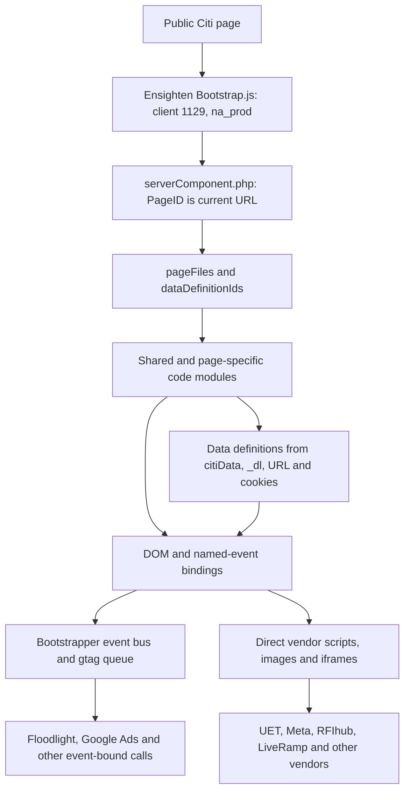

# Citi public Ensighten tag management: code and runtime study

**Public production sample refreshed 29 September 2026.** This study corrects the earlier current-state findings, which covered shared Ensighten modules but missed page-specific modules. It uses unauthenticated Citi pages, their delivered Ensighten JavaScript, a public browser capture, and public vendor documentation. No Ensighten console, login, application completion, payment, transfer, or consent choice was used. Rules and account IDs below describe **delivered code** unless an observed browser request is explicitly stated. They are not a complete Citi property export.

## Direct answer and correction

The earlier report did inspect the Ensighten bootstrap and some library code, but its Ensighten and pixel study was incomplete. In particular, its statement that no executable Microsoft UET tag was established is incorrect for the expanded public sample. The additional banking module contains UET IDs `5695784` and `331000549`; a mortgage module contains UET ID `16005485`. The earlier Floodlight table listed two conversion snippets; this sample exposes 19 mortgage activity rules, three card catalog activity rules, one banking activity rule, and two shared activity rules. These are code-level counts, not observed conversion requests.

## How the Ensighten implementation is assembled

The public [bootstrap](https://nexus.ensighten.com/citi/na_prod/Bootstrap.js) declares client `citi`, `clientId:1129`, production path `na_prod`, version `v13`, and `ensDataLayer`. Its server-component URL includes the current page URL as `PageID`; the response selects module files and data definition IDs. Each file contains `Bootstrapper.bindImmediate`, DOM-ready/parsed/loaded, dependency, or named-event bindings. A downloaded module therefore represents a candidate implementation. A binding may still wait for a data definition, page name, dependency, DOM state, or an application event. `Bootstrapper.triggerEvent` records rule completion and can unlock dependent bindings. The user-facing tag names, unpublished rules and full condition configuration are not in the public scripts.

The expanded sample contains ten distinct public code modules with **141 `Bootstrapper.bind*` calls**, of which **40 register data definitions**. The CSV and JSON binding inventory retain every binding's file, block index, exposed numeric rule/deployment ID where present, binding type, event, destination host, account ID and Floodlight activity fields: [CSV](../../evidence/notes/ensighten_bindings_2026-09-29.csv), [JSON](../../evidence/notes/ensighten_bindings_2026-09-29.json). The 141 count includes wrapper bindings and helpers; it is not a count of marketing tags.

| Sampled public page | Module count | Page-specific module | Public browser result |
|---|---:|---|---|
| [Home](https://www.citi.com/) | 7 | RFIhub/banner helper `89d86490…` | 15 Ensighten rule IDs recorded; selected vendor requests captured |
| [Personal loans](https://www.citi.com/personal-loans) | 6 | No extra page-specific module in this sample | 36 rule IDs recorded; several vendor requests captured |
| [Banking/checking](https://www.citi.com/banking/checking-account) | 7 | Banking conversions and UET `d612f181…` | Module delivered, but only eight shared rule IDs recorded in this browser pass |
| [Mortgage/home mortgage](https://www.citi.com/mortgage/home-mortgage) | 7 | Mortgage conversions `113f5951…` | Module delivered, but no mortgage event rule ran during an untouched page view |
| [Card catalog](https://www.citi.com/credit-cards/view-all-credit-cards) | 7 | Card conversions, Meta and X `7f2dbc2b…` | Module delivered, but only eight shared rule IDs recorded in this browser pass |

The last three observations are especially important: a server-selected module is not proof of page-view firing. In this browser run, `window.UET` and `window.uetq` were undefined on all five sampled pages, and no `bat.bing.com` request appeared. That observation is limited to untouched public page views in this browser state; it does not negate the event-triggered code or establish how the rules behave after application interactions or different consent choices.

## Shared analytics path and event router

The shared `12885707…` module embeds Adobe Target `at.js` 2.11.7 and AppMeasurement 2.27.0. Rule `4257885/593103` creates `window.s_tms` and chooses `citiuscombprod` or `citiuscombdev` using the hostname, with `metrics.citi.com`/`metrics1.citi.com` configured as tracking servers. Rule `4293545/578262` defines `window._trackAnalytics(dataObj)`: it assigns `window._dl`, sets `plat`, reads `cls_e`, parses transfer amounts, builds legacy products/context data, and emits `na_tms_page_view` or `na_tms_custom_event` through Ensighten. Its direct AppMeasurement `s_tms.t()`/`.tl()` call is gated by the absence of `sessionStorage.adobeLaunch`. The Ensighten event emission has its own condition path and should not be assumed to stop when the legacy Adobe send is gated. Rule `2836703/578343` separately replays `stored_analytics` into this legacy helper. The parallel Launch replay and exact-once result require a safe event-level test.

The shared event router then interprets `_dl`, `citiData`, URL and page state. Examples include rule `4061763/692933` for banking application signals; rules `4290491/696250`, `4290490`, `3902040/747863`, `4086427`, `4137258`, `3971674` and `4023840` for card, mortgage, travel, loan and related signals; and `4248823/609397` for bank/mortgage lead events. Rule `4290491` emits named `tms_floodlight_pixel_cardsNGAapplication_*`, `tms_rokt_pixel_*`, `tms_meta_*`, and `tms_strataElite_*` events using `_dl` and hard-coded NPV values. No destination handler for those particular emitted names was located in the sampled delivered modules. They are **event names**, not confirmed Floodlight, Meta, Rokt or Strata requests. Rule `4002624/623461` binds banner click data from DOM attributes and calls `taggingDataLayer.updateEventData("nonicms_content", …)`; no banner click was performed here.

The 40 public data definitions include `citiData_pageName` (`17006`), `citiData_dd_CUUID` (`17005`), `citiData_ccsid` (`21528`), `citiData_prospectID` (`46012`), `citiData_ISN` (`46013`), `ExternalCampaignTracking ID_dl` (`65901`), and mortgage URL fields `ProspectID_ifxurl` (`69552`), `RecordID_lfxurl` (`69553`), `ISNValue_lfxurl` (`69554`). The binding inventory lists all names and IDs. Their values were not retained.

## Google tag and Floodlight

Shared rule `4146255/639140` creates `dataLayer`, loads `gtag/js`, configures five base IDs (`DC-6260004`, `DC-6269322`, `DC-6256710`, `DC-6415812`, `DC-6268858`) and drains `Bootstrapper.gtag.events`. A base `gtag/js?id=DC-…` load means the tag library was requested; it does not identify an activity. On personal loans and mortgage, all five base script URLs appeared. One `ad.doubleclick.net/ccm/s/collect` request appeared in each capture, but the sanitized capture did not map it to an activity. The delivered conversion rules are detailed in the appendix and workbook.

Mortgage's `113f5951…` module has 19 `DC-6256710` activity bindings for Dragonfly application starts/completions, HomeRun and lending submit buttons, organic mortgage, affiliate confirmations, registration, VA loans and HELOC leads. Most use `+unique` and custom `u` fields. Some read URL affiliate parameters and mortgage data definitions. Several source literals have leading whitespace before `DC-`; one spells `DC- 6256710` with an embedded space. Those strings may affect request formatting and need a controlled event capture. The sample did not produce the application events, so no mortgage conversion request is confirmed.

The banking module has `DC-6269322/bankp00/proje0+unique` on DOM loaded, with a leading space before the ID. The card module has `DC-6260004/misce0/citic0+transactions`, `/cardslp/cards005+transactions`, and `/landi0/viewcard+transactions`; values are a literal `Manage.DD_citiData.citiData_dd_pageDef` string or literal `1`, with random transaction IDs. The shared module has `DC-6260004/cardslp/trave000+transactions` on `TravelPortal`; another shared module has `DC-6260004/citih0/citih00+transactions` when data definition `17006` contains `Username Password`. The custom fields and identifiers in code are not proof of valid or revenue-bearing conversion payloads. See [Google's Floodlight tag field reference](https://support.google.com/campaignmanager/answer/7554821?hl=en).

## Microsoft Advertising UET: corrected inventory

| Public code module | Rule/deployment | Binding | Public UET tag ID | Code behavior | Runtime result in this sample |
|---|---|---|---|---|---|
| Banking `d612f181…` | `4127256/750588` | DOM loaded | `5695784` | Loads `//bat.bing.com/bat.js`, constructs `new UET`, pushes `pageLoad` | Module delivered; no UET rule recorded or request captured |
| Banking `d612f181…` | `4127257/755905` | DOM loaded after dependency `4061763/692933` | `331000549` | Loads `bat.js` again, replaces shared `uetq` with `new UET`, pushes `pageLoad` and an otherwise empty custom event object | Same limitation |
| Mortgage `113f5951…` | `3854519/737752` | Dragonfly completions and HomeRun/lending submit events | `16005485` | Loads `bat.js`, constructs UET, pushes `pageLoad` | Module delivered; event not generated |
| Mortgage `113f5951…` | `3941780/753838`; `3941781/753840` | Registration complete/start | `16005485` | Repeats loader and UET initialization; adds `ec` such as `Registration Complete`/`Registration Start` | Event not generated |
| Mortgage `113f5951…` | `3971675/758206`; `4026446/765181`; `4026445/765182` | VA loan and HELOC events | `16005485` | Repeats initialization; passes `ec` and `ea` from `_dl` in some paths | Event not generated |

These are **three distinct publicly delivered tag IDs**, not a verified account count. Multiple rules overwrite the same global `uetq` with new UET instances; ordering and duplicate `pageLoad` behavior cannot be resolved from delivered code alone. No validated conversion value or currency is present in these UET snippets. [Microsoft's UET guide](https://learn.microsoft.com/en-us/advertising/guides/universal-event-tracking?view=bingads-13) explains the tag mechanism; it does not establish Citi's runtime behavior.

## Other third-party implementations inside Ensighten

| Vendor or endpoint | Delivered implementation | Browser evidence in this untouched sample |
|---|---|---|
| Google Ads | Banking base `AW-11360697733`; mortgage event-bound `AW-830907969` conversion labels for Dragonfly, registration, VA and HELOC | Banking/mortgage event sends not captured |
| Meta Pixel | Card module has IDs `1331633391375445`, `1518217385934838`, `785778561253923`; `PageView` and for two IDs `ViewContent`; two rules call `dataProcessingOptions(["LDU"],1,1000)` | Card module delivered; Meta requests not captured |
| X/Twitter Pixel | Card rule `4307179/799919` loads `static.ads-twitter.com/uwt.js`, config `rcduz`, `restricted_data_use:"restrict_optimization"` | Module delivered; request not captured |
| Rakuten | Mortgage rules load `tag.rmp.rakuten.com/125655.ct.js` for Dragonfly/registration and affiliate events | No corresponding event generated |
| Kenshoo/Skai | Nine mortgage rules load `services.xg4ken.com/js/kenshoo.js` with `rm_trans` lead fields, affiliate IDs and sometimes prospect/order fields | No corresponding event generated; [Tealium's vendor example](https://docs.tealium.com/iq-tag-management/tags/tealium-custom-container-tag/) identifies that script as Kenshoo |
| Tapper | Mortgage rules `4296315/802926` and `4296314/803170` load `monitor.tapper.ai/bundle.js`; one pushes a coded `1000 USD` value. Token-like initialization key is redacted in saved evidence. | No corresponding event generated; [Tapper documentation](https://docs.tapper.ai/docs/ad-fraud-protection/google-ads-protection/shopify-app-install) identifies this loader |
| Rezync/Zync | Shared Ensighten rules `3994828/755023` and `4081630/765489` build `live.rezync.com/sync` URLs from `_dl`; mortgage module has an event rule that sends literal placeholder strings such as `{event}` instead of resolved values | Shared `citibank-pixel-6667` `/sync` request captured on personal loans and mortgage; mortgage-specific event untested |
| RFIhub/Zeta | Shared rules load `c1.rfihub.net/js/tc.min.js`; `_o=17169175`, `ca` varies with page/application state; separate signoff and failure code | Script and `20766699p.rfihub.com/ca.html` observed on personal loans and mortgage |
| LiveRamp | Shared `c.tvpixel.com` loader and a `sr.rlcdn.com/425466.html` iframe using SHA-1 of normalized CCSID cookie or `citiData.ccsid` | Both endpoints observed on personal loans and mortgage; raw identity value not retained |
| Amazon Ads | Shared rule `3869558/740752` creates an image to `s.amazon-adsystem.com/iu3` with a static public `pid` and `PageView` | Image request observed on personal loans and mortgage |
| Qualtrics | `2c49a47b…` loads Site Intercept `Q_ZID=ZN_3VI8kkudS0JJRFc` with sampling; shared COPA code has an additional path | Qualtrics loader observed on personal loans and mortgage |
| Experience detector | `76c8f300…` injects `cdn.gbqofs.com/citi-na-prod/p/detector-dom.min.js` | Request observed on home, personal loans and mortgage; ownership attribution inferred from host |

## Architecture and implementation risks visible from code

1. **Layer overlap:** Ensighten's legacy AppMeasurement and the Adobe Launch Web SDK both have analytics paths. The legacy direct-send gate checks `sessionStorage.adobeLaunch`; Ensighten events may still dispatch. A safe side-by-side beacon capture is needed to assess duplicate Adobe sends.
2. **Event-to-pixel gap:** Several `tms_*` names are emitted without a matching destination handler in these modules. Treat them as routing signals until a handler or request is found.
3. **Global state and repeated loaders:** UET's `uetq`, Meta's `fbq`, `dataLayer`/`gtag`, and the Ensighten event queue are shared globals. Several event rules initialize the same vendor repeatedly, making ordering material.
4. **Hard-coded and questionable parameters:** Floodlight `send_to` whitespace, literal card value strings, random transaction IDs, the mortgage Rezync placeholders, and Tapper's coded amount are directly visible in source. Whether they reach vendor endpoints exactly as written remains unverified.
5. **Identity fields:** Some rules reference CUUID, CCSID, prospect/record IDs, URL affiliate parameters and page names. This study records field names and transformations only. Consent handling and actual payload values require approved test states.

## Evidence and limits

- The browser run visited the five linked pages above with separate disposable profiles. It did not click, log in, choose consent, or submit a form. Its sanitized request log is [public_ensighten_runtime_2026-09-29.json](../../.artifact-runtime/public_ensighten_runtime_2026-09-29.json): vendor host/path, public configuration IDs and request counts only; no cookie, query identity value, body or customer data.
- The bootstrap and seven previously saved modules were byte-identical on the 29 September refresh. New banking, mortgage and card module copies are in `evidence/raw/`. The mortgage raw copy was redacted in two places to remove the token-like Tapper key; original downloaded SHA-256 was `9b357165fe79ebefc5641cffc8d0f530600c71d41e1fcf7c77f2fc7dcd2c5a5d`.
- Module manifests, code, browser rule logs and network requests have different evidentiary meaning. No absence claim extends beyond the five sampled public page views or their observed state. Console names, hidden conditions, ownership, account associations, consent policy and conversion correctness remain unknown.

## Appendix A: all mortgage Floodlight activity bindings

The following table is generated from the delivered `113f5951…` code. `u` field names are code-level parameters; no values were retained. All activity rows are **code observed, event request unverified**.

| Rule / deployment | Ensighten event | `send_to` code | `u` fields |
|---|---|---|---|
| `4148390/737518` | `DragonflyAppStart_BUY` | `DC-6256710/newmo0/mortg0+unique` | `u1`, `u12`, `u2`, `u3`, `u4`, `u6`, `u7`, `u8`, `u9` |
| `4167965/737519` | `DragonflyAppComplete_BUY` | `DC-6256710/newmo0/mortg00+unique` | `u1`, `u10`, `u11`, `u12`, `u2`, `u3`, `u4`, `u6`, `u7`, `u8`, `u9` |
| `3874512/737630` | `MortgageHomeRunSubmitButton_BUY` | `DC-6256710/newmo0/mortg000+unique` | None visible |
| `3874516/737631` | `MortgageHomeRunSubmitButton_REFI` | `DC-6256710/newmo0/mortg001+unique` | None visible |
| `3874513/737632` | `MortgageLendingPageSubmitButton` | `DC-6256710/newmo0/mortg002+unique` | None visible |
| `4074812/737633` | `MortgageOrganicPageSubmitButton_BUY` | `DC-6256710/newmo0/mortg004+unique` | `u1`, `u3`, `u4` |
| `4074811/737634` | `MortgageOrganicPageSubmitButton_REFI` | `DC-6256710/newmo0/mortg003+unique` | `u1`, `u3`, `u4` |
| `4148388/737701` | `DragonflyAppStart_REFI` | `DC-6256710/newmo0/mortg005+unique` | `u1`, `u12`, `u2`, `u3`, `u4`, `u6`, `u7`, `u8`, `u9` |
| `4167964/737702` | `DragonflyAppComplete_REFI` | `DC-6256710/newmo0/mortg006+unique` | `u1`, `u10`, `u11`, `u12`, `u2`, `u3`, `u4`, `u6`, `u7`, `u8`, `u9` |
| `3874511/737703` | `MortgageDRS_LeadSubmission_SubmitButton` | `DC-6256710/newmo0/mortg007+unique` | None visible |
| `3947440/752166` | `Mortgage_Affiliates_Refinance_Confirmation` | `DC-6256710/newmo0/mortg00d+unique` | `u1`, `u3`, `u4`, `u6`, `u7`, `u8` |
| `3947439/752167` | `Mortgage_Affiliates_Confirmation` | `DC-6256710/newmo0/mortg00b+unique` | `u1`, `u3`, `u4`, `u6`, `u7`, `u8` |
| `4074810/753132` | `Mortgage_Registration_Start` | `DC-6256710/newmo0/mortg00g+unique` | `u1`, `u3`, `u4` |
| `4078802/753133` | `Mortgage_Registration_Complete` | `DC-6256710/newmo0/mortg00h+unique` | `u1`, `u3`, `u4` |
| `3947438/754703` | `Mortgage_Affiliates_FTHB_Purchase_Confirmation` | `DC- 6256710/newmo0/mortg00f+unique` | `u1`, `u2`, `u3`, `u6`, `u7`, `u8` |
| `3971688/758262` | `Mortgage_VA_Loan_Purchase` | `DC-6256710/newmo0/mortg00z+unique` | `u1`, `u3`, `u4` |
| `3971689/758263` | `Mortgage_VA_Loan_Refinance` | `DC-6256710/newmo0/mortg00_+unique` | `u1`, `u3`, `u4` |
| `4074814/764880` | `HELOC_Lead_Start` | `DC-6256710/globa0/mortg035+unique` | `u1`, `u3`, `u4` |
| `4074813/764881` | `HELOC_Lead_Submit` | `DC-6256710/globa0/mortg036+unique` | `u1`, `u3`, `u4` |

## Appendix B: complete public binding inventory

The [CSV](../../evidence/notes/ensighten_bindings_2026-09-29.csv) and [JSON](../../evidence/notes/ensighten_bindings_2026-09-29.json) contain every extracted binding from the ten modules, including all 40 data definitions and nonpixel helper rules. The revised workbook adds these rows and the expanded Floodlight/UET inventory for filtering.
